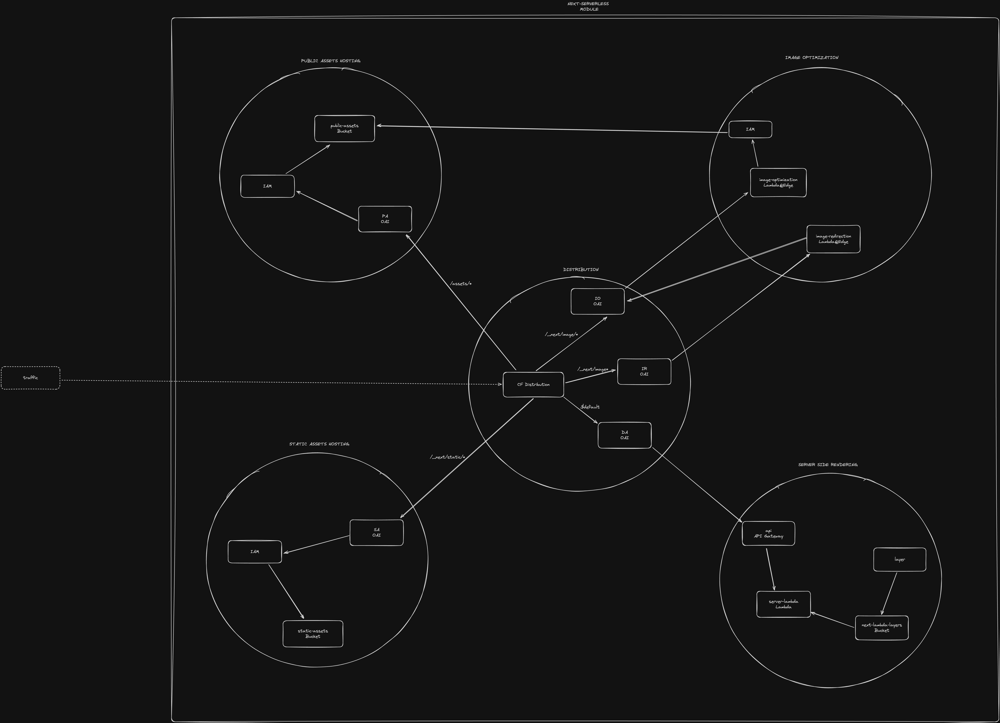
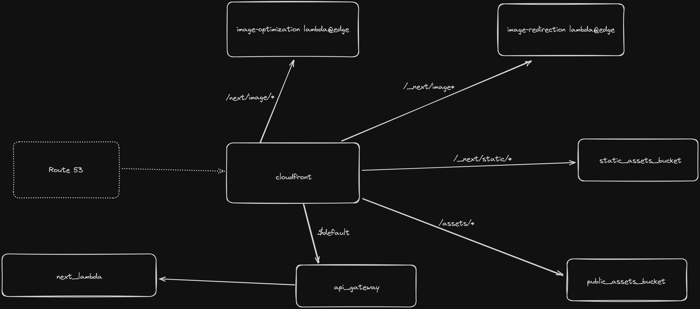

# terraform-aws-nextjs-serverless


## Setup

### Prepare 

Add the following dependencies to your package.json.

```json
package.json

{
  "scripts": {
    "build-serverless-next": "build-serverless-next",
    ...
  },
  "dependencies": {
    "build-serverless-next": "latest",
    "next": "^13",
    ...
  },
  ...
}
```
### Create Terraform deployment

Ensure that the deployment name is unique since its used for creating s3 buckets.


```
main.tf

provider "aws" {
  region = "eu-central-1" # customize your region
}

provider "aws" {
  alias  = "global_region"
  region = "us-east-1"
}

module "next_serverless" {
  source  = "Nexode-Consulting/nextjs-serverless/aws"

  deployment_name = "nextjs-serverless" #needs to be unique since it will create an s3 bucket
  region = "eu-central-1" # customize your region
  base_dir = "./"
}
```

### Deployment
Build the Next.js Code and deploy
```bash
npm run build-serverless-next
terraform apply
```


## Visualization

### Module Diagram


### Distribution Diagram

